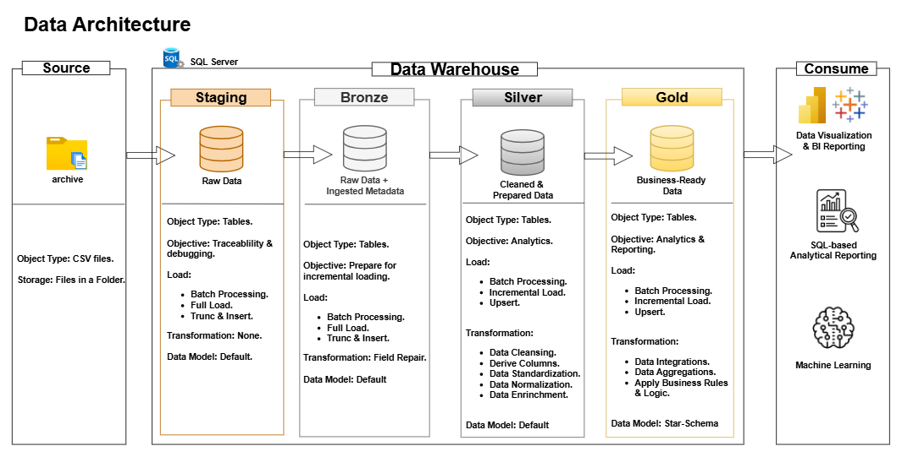

# Data Warehouse and Analytics Project
Welcome to my **Data Warehouse and Analytics Projects** — a complete end-to-end implementation that builds a modern data warehouse from the ground up.

This project showcases industry best practices in data warehousing and analytics, following the Medallion Architecture (Bronze, Silver, Gold). Designed as a portfolio project, it provides a comprehensive demonstration — from designing and building a data warehouse to generating SQL-based analytical reports.

---

## Project Overview
The goal of this project is to use the **Medalion Approach** to build a modern data warehouse that consolidates multiple sales datasets (customers, products, orders, events etc.) into a unified analytical environment. This project performs the following operations:

* **Project Requirement**: Analyze and understand what is expected from our data warehouse.
* **Data Management Approach**: Choose the appropriate data management approach.
* **Data Architecture**: Create and design the data architecture.
* **ETL Pipeline**: Create an etl pipeline that extracts, transforms, and loads data into the data warehouse.
* **ETL Logging**: Creata etl log tables that track every etl run to enable easy etl monitoring, traceability, and debugging.
* **Data Modeling**: Build a data model that integrates all business objects.
* **Data Analytics**: Generate SQL-based analytical reports that support business insights and decision-making.

## Skills Demonstrated
* **Data Architecture**
* **SQL Development**
* **Data Engineering**
* **ETL Pipeline Design**
* **Data Cleansing & Transformations**
* **Data Modeling**
* **Data Analytics**

---
## 1. Data Engineering

## Project Requirement
Build a modern data warehouse that supports easy data access, retrieval, and analytical reporting.

## Specifications
* **Data Source**: Extract CSV files from a central source system (archive).
* **Data Quality**: Resolve data quality issues prior to analysis.
* **Data Integration**: Consolidate sales data to support analytical reporting.
* **Scope**: Focus on latest and historical data; historization allowed.
* **Documentation**: Provide clear documentation to support analytical teams and business stakeholders.

## Objectives
* **Build Staging Layer**
* **Build Bronze Layer**
* **Build Silver Layer**
* **Build Gold Layer**

---

## 2. Data Analytics
This phase focuses on two key areas of analytics: **Exploratory Data Analytics (EDA)** and **Advanced Data Analytics**.

## Objectives
Generate SQL-based analytical reports that shows insights into:
* **Customer Behavior**
* **Product Performance**
* **Sales Trends**
* **Overall Business Performance**

These insights provide key business metrics that support business stakeholders in decision-making.

---

## Data Architecture
This data architecture follows the medallion architecture **Bronze**, **Silver**, and **Gold**, with an additional **Staging** layer.

1. **Staging**: Permanent raw file storage.
2. **Bronze**: Raw data + ingested metadata + structural fixes needed to load the data.
3. **Silver**: Cleaned and prepared data.
4. **Gold**: Business-ready data.

## License
This project is licensed by **[MIT License]**. You can use and modify it with proper attributions.

---

## About Me
Hi there! I'm **Otusanya Toyib Oluwatimilehine**, an aspiring **Data Engineer** passionate about building reliable data pipelines, efficient data models, and turning raw data into meaningful insights. 

 **07060784176** 
 **toyibotusanya@gmail.com**

